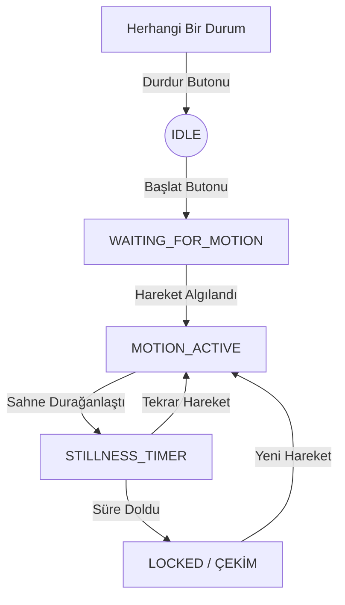

<h1 align="center">
  📸 OsCapture
</h1>

<p align="center">
  <b>Hareket algılayarak otomatik fotoğraf çeken akıllı Android kamera uygulaması</b>
</p>

<p align="center">
  
  
  
</p>

<p align="center">
  
  
  
</p>

---

## 🚀 Proje Hakkında

**OsCapture**, kamera görüntüsünü gerçek zamanlı analiz ederek sahnedeki nesneler belirli bir süre hareketsiz kaldığında **otomatik olarak** fotoğraf çeken bir Android uygulamasıdır. Özellikle vahşi yaşam gözlemi, timelapse başlangıçları veya sabit kadraj gerektiren otomatik çekim senaryoları için tasarlanmıştır.

Fotoğraf çekildikten sonra sistem kendini kilitler; bu sayede aynı sahnenin gereksiz yere onlarca fotoğrafının çekilmesi engellenir. Yeni bir hareket algılandığında sistem tekrar aktif hale gelir.

## ✨ Temel Özellikler

- **Piksel Bazlı Hareket Analizi:** Ardışık karelerin Y-plane piksellerini (parlaklık) örnekleyerek düşük güç tüketimiyle hassas hareket tespiti.
- **Dinamik Bekleme Süresi:** 0.5 saniyeden 10 saniyeye kadar ayarlanabilir hareketsizlik eşiği.
- **Akıllı Kilit Mekanizması:** Fotoğraf çekimi sonrası otomatik kilit — yeni bir hareket algılanmadan tekrar çekim yapmaz.
- **Gerçek Zamanlı Durum Takibi:** State Machine tabanlı arayüz ile uygulamanın o an ne yaptığını (bekliyor, hareket var, zamanlıyor, kilitli) anlık görme.
- **Modern UI:** Material 3 ve Jetpack Compose ile temiz, hızlı ve kullanıcı dostu arayüz.

## 🛠 Teknik Mimari (State Machine)

Uygulama, güvenilir bir çekim süreci için aşağıdaki durum makinesini kullanır:



## 🏗 Geliştiriciler İçin

Bu proje artık **açık kaynak** bir projedir. Katkıda bulunabilir, fork edebilir veya kendi projelerinizde referans alabilirsiniz.

### Gereksinimler
- Android Studio Ladybug veya üzeri
- JDK 17+
- Android Device (API 24+)

### Nasıl Derlenir?
1. Repoyu klonlayın:
   ```bash
   git clone https://github.com/ottamina/OsCapture.git
   ```
2. Android Studio ile projeyi açın.
3. `local.properties` dosyasının SDK yolunuzu içerdiğinden emin olun.
4. Gradle senkronizasyonunu bekleyin ve cihazınıza yükleyin.

## 📱 İndirme

Derlenmiş en güncel sürümü (APK) [`releases`](releases/) klasöründe bulabilirsiniz:

👉 **[OsCapture-v1.0.apk](releases/OsCapture-v1.0.apk)**

## 📚 Teknolojiler

- **Kotlin:** Modern Android geliştirme dili.
- **Jetpack Compose:** Deklaratif UI kütüphanesi.
- **CameraX:** Kamera önizleme, analiz ve fotoğraf çekimi için Google kütüphanesi.
- **Coroutines & Handler:** Asenkron işlemler ve zamanlayıcılar için.

## 📄 Lisans

Bu proje **MIT Lisansı** altında korunmaktadır. Daha fazla bilgi için [LICENSE](LICENSE) dosyasına göz atabilirsiniz.

---

<p align="center">
  Geliştiren: <b><a href="https://github.com/ottamina">Osman Teksoy</a></b>
</p>
